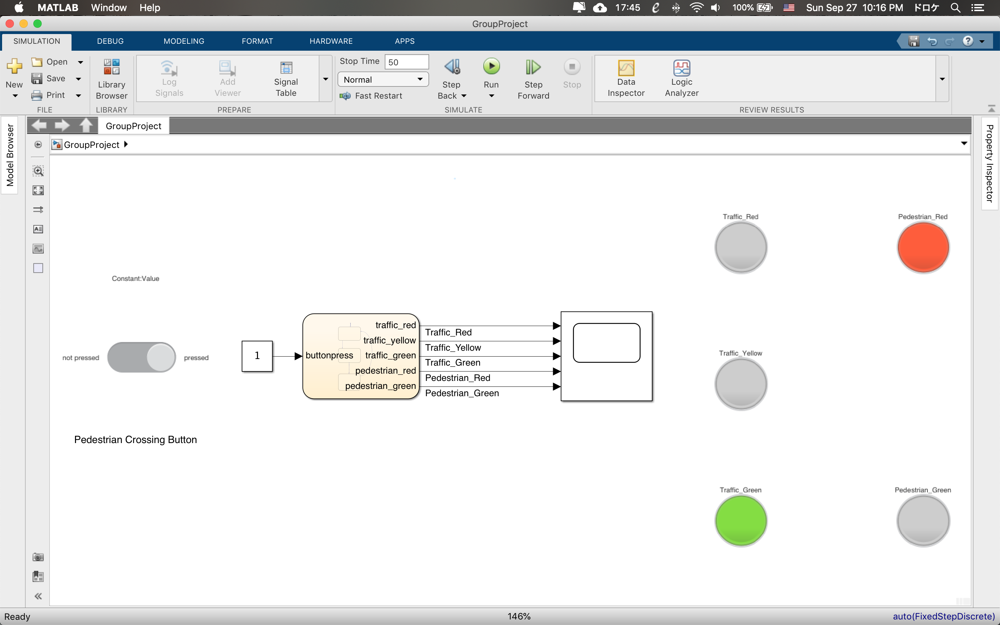
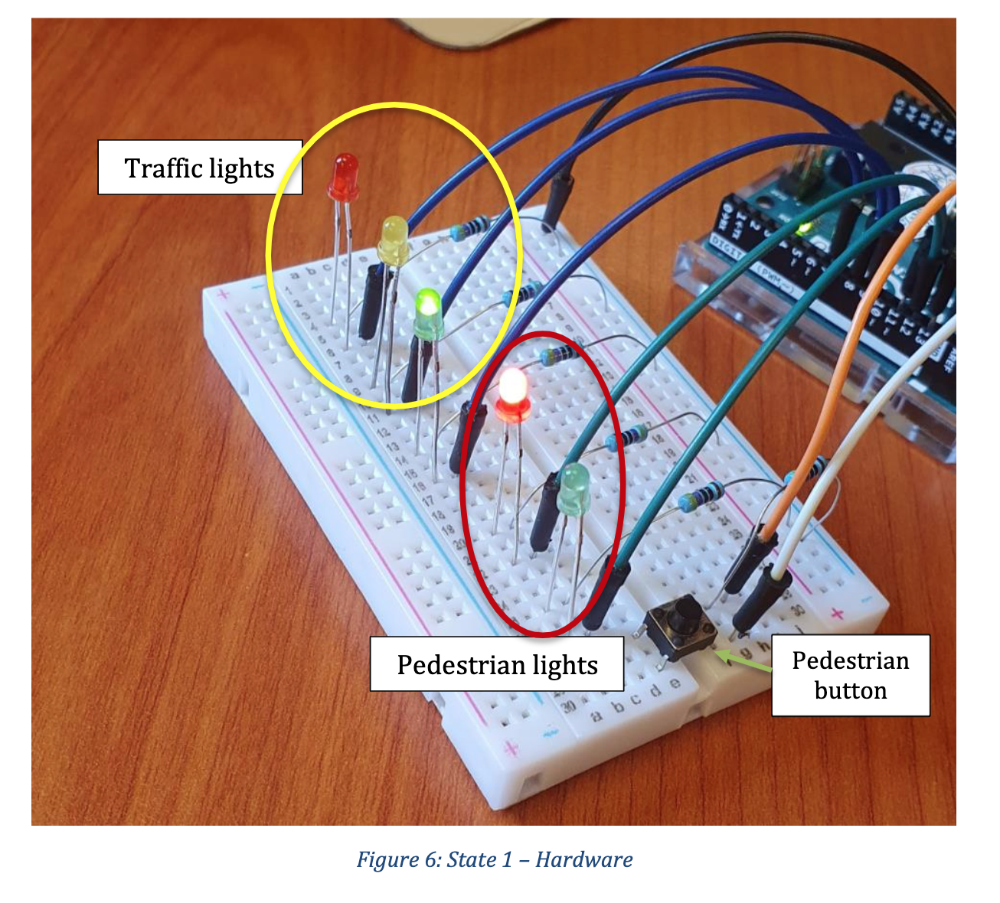

# Traffic Light (MATLAB Simulink)

### Table of Contents
* [Project Description](#description)
* [How to run?](#run) 
* [Connect](#connect)

# Project Description
* Final project for OENG1207 – Digital Fundaments
* Traffic light system in MATLAB/Simulink environment, deployed on Arduino
* Full project report can be found in docs folder

***Screenshots***

* Final system with Arduino input/output ports:

* Deploying on Arduino:

## How to run?
Open the `Final_Project.slx` in MATLAB's Simulink environment

## Connect with me
* My [Facebook](https://www.facebook.com/Hoangdayo/)
* My [Instagram](https://www.instagram.com/hoang.desu/)
* You can shoot me an [email](mailto:hoangdesu@gmail.com) too

If you find this project useful, you can let me know. I would love to hear about it!

